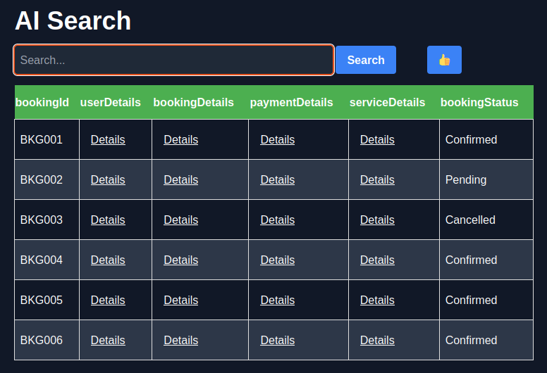
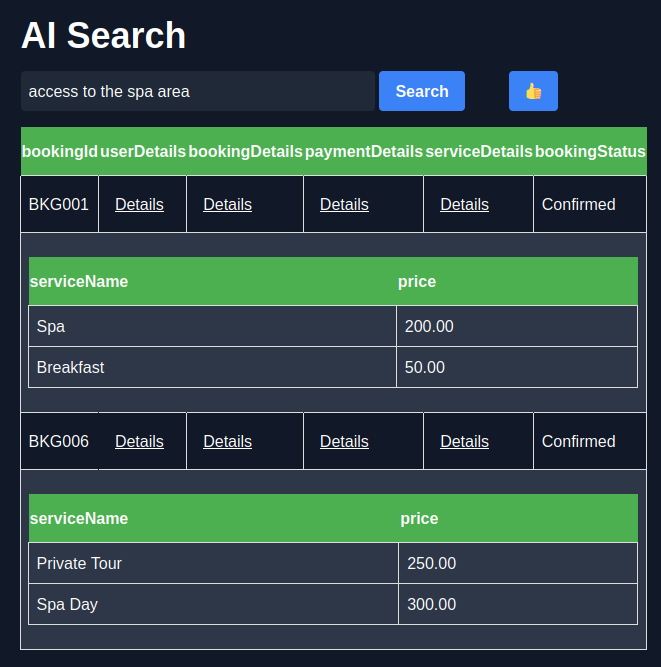
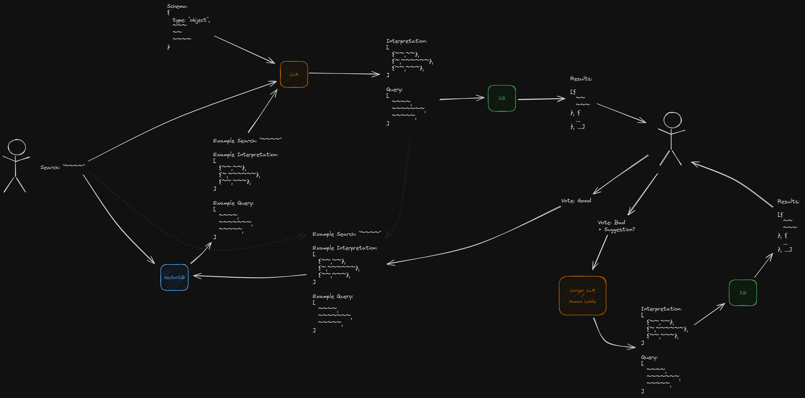

# Structured document search (text2nosql)

This project showcases how LLMs can be trained and used to intuitively filter
structured and nested document collections, commonly found in web applications.
The goal is to build a smart search system capable of interpreting natural
language queries and generating accurate NoSQL queries.

## Table of Contents

- [Challenges](#challenges)
- [Demo application](#demo-application)
  - [Prompt Format](#prompt-format)
    - [Instruction](#instruction)
    - [Input](#input)
    - [Output](#output)
- [User-feedback for Retrieval-Augmented Few-Shot Prompting](#user-feedback-for-retrieval-augmented-few-shot-prompting)
  - [Example Realtime Improvement](#example-realtime-improvement)
  - [Negative feedback](#negative-feedback)
- [Custom Query Operators](#custom-query-operators)
- [Synthetic Training Data](#synthetic-training-data)
  - [Iterative Training](#iterative-training)
  - [Related Training Data](#related-training-data)
- [Artifacts](#artifacts)

## Challenges

Filtering large datasets using natural language poses several challenges:

1. Accuracy - Showing only documents that match all query criteria
2. Ambiguity - Accounting for synonyms, abbreviations, paraphrasation, etc
3. Latency - User patience being a limited resource
4. Context - Resolving terms like 'by me' or 'yesterday' correctly requires
   additional context
5. Ease of Use - Preventing technical details from surfacing to the users

To overcome these challenges we fine-tune a minimally sized language model to
generate NoSQL queries.

## Demo application

The demo application included in this repository uses a hotel booking dataset
with multiple nested fields and lists:



Nested fields are shown as links and allow you to unveil a nested table. Here is
an example after clicking the "serviceDetails" field:



Prompting for bookings with "access to the spa area" correctly yields all two
entries that include a service that contains the text "Spa", loosely
interpreting the input phrase, as shown in the image above.

The generated query for this example looks as follows:

```json
{
  "$and": [
    {
      "serviceDetails": {
        "$elemMatch": {
          "serviceName": {
            "$text": "Spa"
          },
          "price": {
            "$gt": 0
          }
        }
      }
    }
  ]
}
```

_Note the use of the $elemMatch operator for arrays as described by the document
schema for the serviceDetails field._

## Prompt Format

### Instruction

```jinja
You are given the schema of a NoSQL collection, some context information about the environment, and a request from a user. Your task is to first write down your interpretation of the request and then generate a NoSQL query object in JSON that answers the request.
Here is a list of available operators:,

{{ operator }},

You can use the following common operators: {{ defaultOperators }}
```

<details>

#### Operators

See [Custom Query Operators](#custom-query-operators)

</details>

### Input

````jinja
Schema:
```json
{{ "items" in schema ? schema.items | tojson(indent=0) : schema | tojson(indent=0) }}
```


Example Context:
```json
{{ example.context | tojson(indent=0) }}
```

Example Request: {{ example.request | tojson(indent=0) }}
Example Interpretation:
```json
{{ example.interpretation | tojson(indent=0) }}
```
Example Query:
```json
{{ example.query | tojson(indent=0) }}
```


Context:
```json
{{ context | tojson(indent=0) }}
```

Request: "{{ request }}"
````

<details>

#### Schema

We include the document schema here to allow the model to write query that are
valid against this schema and to correlate between the user input and the
existing field names and values in the target documents.

#### Example

See
[User-feedback for Retrieval-Augmented Few-Shot Prompting](#user-feedback-for-retrieval-augmented-few-shot-prompting)

#### Context

In order to correctly resolve the current date, time and personal information,
like the current user name or ID, we include a context section will all the
relevant information

#### Request

This is the input string as provided by the user.

</details>

### Output

````jinja
Interpretation:
```json
{{ interpretation | tojson(indent=0) }}
```
Query:
```json
{{ query | tojson(indent=0) }}
```
````

<details>

#### Interpretation

TODO We use a CoT-like structure here, letting the model segment the input into
different sections and keywords. This can also be used for explainability and
even shown to the user in addition to the results.

#### Query

The output NoSQL query, formatted as JSON.

</details>

## User-feedback for Retrieval-Augmented Few-Shot Prompting

We integrate user-feedback by storing voted good queries in a vector database.
Prior to query generation the most similar voted search and query is included as
an example. This allows for realtime improvements to the system as well as
eliminating mistakes prior to deployment.

Here is an overview of the demo application architecture and prompt design:



### Example Realtime Improvement

Using `over 800 EUR` as input results in the following query:

```json
{
  "paymentDetails.totalAmount": {
    "$gt": 800
  }
}
```

This query is clearly missing the currency aspect! We can refine the query as
`over 800 and currency EUR`, improving the result:

```json
{
  "$and": [
    {
      "paymentDetails.totalAmount": {
        "$gt": 800
      }
    },
    {
      "paymentDetails.currency": {
        "$keyword": "EUR"
      }
    }
  ]
}
```

We can now use the feedback button to mark this query as a good example. Now
when we input `over 500 USD`, the system will use in-context learning from the
previous query to correctly generate the following query:

```json
{
  "$and": [
    {
      "paymentDetails.totalAmount": {
        "$gt": 500
      }
    },
    {
      "paymentDetails.currency": {
        "$keyword": "USD"
      }
    }
  ]
}
```

### Negative feedback

TODO Negative feedback can be used to document failure-cases and allows for
automated query refinement using more capable but slower models.

## Custom Query Operators

In order to improve results the default mongodb query syntax was extended with
the following operators:

```
`{ $keyword: string }` - Matches Names, IDs, enums, and similar strings, uses fuzzy matching to correct for typos. Use this for exact, syntactic matches.
`{ $text: string }` - Matches properties that contain the given search and common synonyms. Use this for semantic matches, like titles, descriptions, details, species, classes of objects etc.
`{ $year: number }` - Matches ISO dates that have the given year.
`{ $month: number }` - Matches ISO dates that have the given month.
`{ $day: number }` - Matches ISO dates that have the given day.
`{ $dayOfWeek: 1-7 }` - Matches ISO dates that have the given day of the week, where 1 is Monday and 7 is Sunday.
`{ $time: "HH:mm:ss" }` - Matches ISO dates that have the given time.
`{ $date: "YYYY-MM-DD" }` - Matches ISO dates that have the given date.
```

## Synthetic Training Data

The training set was generated using a multi-step process on a high performance
large coding model. The task was divided into the following steps:

1. Generate a diverse set of document types
2. For each document type generate a json-schema
3. Generate 6 sample entries for each schema
4. Given those samples, generate statements that are only true for one of the
   samples
5. Simplify / shorten those statements
6. Given the schema and a statement, use CoT to generate a NoSQL query
7. Validate that the generated query matches only exactly one sample
8. Add valid queries to the training set and failed queries to a failure-case
   set


### Iterative Training Process

Once between 100 to 300 valid queries are collected using `Mistral-large` with
few-shot prompting, we found that a fine-tuned `Mixtral-8x7b` already
outperformed the initial approach. We then repeated steps 6-8 using the newly
trained model on the failure-case set, doubling our success-rate. The ratio of
valid to failed queries was used to evaluate base-model and hyperparameter
performance. This process was repeated until a sufficiently accurate and fast
model had been trained.

### Related Training Data

In addition to the above, we added another 2000 training samples from
[Clinton/texttosqlv2_25000_v2](https://huggingface.co/datasets/Clinton/texttosqlv2_25000_v2)
as a closely related task specific dataset. This mixture greatly improved model
performance on the NoSQL task as well.

## Artifacts

We successfully generated over 1200 training samples. We then trained several
adapters for a variety of models and found `codellama-13b-instruct` to strike a
great balance between speed and accuracy. The training set and LoRA adapter can
be found in the `training` and `inference` directories in this repository.
